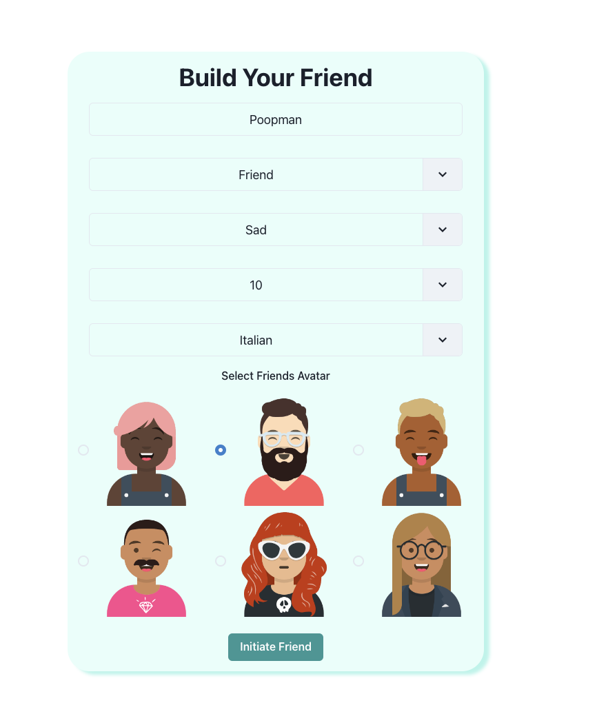

# invisible-friend 

## Table of Contents

1. [Description](#description)
2. [Installation](#installation)
3. [Usage](#usage)
4. [Screenshot](#screenshot)
5. [Testing](#testing)
6. [Contributors](#contributors)
7. [License](#license)
8. [Questions](#questions)

## Description 
    
This is an AI generated friend. Customize your friend or teacher and start chatting!
    
## Installation 
    
No installation necessary, navigate to https://invisible-friend322.herokuapp.com/

## Usage 
    
Create an account, create a bot, and start chatting!    

## Screenshot 

## Testing 

Log on and check it out!

## Contributors 
    
Derek Araujo, Philip Neumann, Shannya Nivyro, Emma Paris, Chad Rajcooar, Colin Sprows, Laert Xhumari

## License 
    
This is an AI generated friend. Customize your friend or teacher and start chatting!

## Questions 

Philip Scott Neumann

https://github.com/moviefan322

philman202@yahoo.com
    